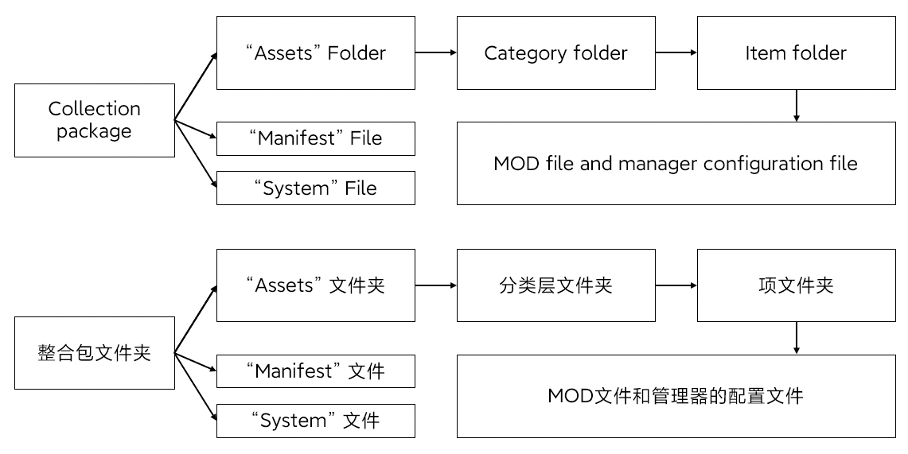

首先注意在英语中并不存在“整合包”这个词，所以我只能用“集合包”这个词来翻译。

First of all, note that the word "整合包" does not exist in English, so I can only use the term "集合包" to translate.

## 整合包概述 Collection package Overview：
整合包就是一个文件夹，就像一个巨型数据库。其根目录有：Assets 文件夹、两个无后缀的 Manifest 和 System 验证信息文件。验证信息这个设定是为中国大陆的用户设计的，如果你不是中国大陆地区的用户，则不必过多了解这个东西。验证信息文件会加密保存创建者的计算机名称和用户名称以及创建者自定义的标识名称，以帮助其他人识别其来源（注意：根据世界各国的相关规定，你几乎只能在中国大陆地区公开整合包供其他人下载，我不是在鼓励盗版的传播，毕竟中国大陆地区的玩家很多都是靠着他人复制得到的MOD）。Assets 文件夹存放整合包的所有MOD文件，这个文件夹里面一层是分类文件夹，在每个分类文件夹里的文件夹是项文件夹，项文件夹包含MOD本身的文件和管理器所需的配置文件。

The collection package is a folder, like a giant database. Its root directory has: Assets folder, two "Manifest" and "System" authentication information files without suffix. The authentication information setting is designed for users in mainland China. If you are not a user in mainland China, you don’t need to know too much about this. The verification information file will encrypt and save the creator’s computer name and user name as well as the creator’s customized Mark Name to help others identify its source (note: according to the relevant regulations of the world, you can almost only openly integrate in mainland China The package is for others to download. I am not encouraging the spread of piracy. After all, many players in mainland China rely on others to copy mods). The Assets folder stores all the MOD files of the collection package. The first level of this folder is the category folder. The folder in each category folder is the item folder. The item folder contains: the files of the MOD itself and the manager The required configuration file.

总的来说，整合包结构如下图所示，图中的箭头表示“它的文件夹下”  
In general, the collection package structure is shown in the figure below, and the arrow in the figure means "under its folder"

## 创建整合包 Create a collection package
当你安装好 SMUI PRO 20 后，在开始菜单找到 “Package Tool V3” 应用程序，此工具用来创建新的空整合包，如果你希望升级第二代产品的整合包，我同样提供了一键升级的功能

After you install SMUI PRO 20, find the "Package Tool V3" application in the start menu. This tool is used to create a new empty collection package. If you want to upgrade the collection package of the second generation product, I also provide one-click Upgraded features

## 在设置中指定整合包 Specify the collection package in the settings
现在打开 SMUI PRO 20，在设置中设定游戏文件夹和整合包文件夹，然后点击保存，程序会解密整合包中的验证信息，前面说过了，然后确认信息即可。程序会自动检查输入内容，游戏文件夹必须存在 "Stardew Valley.exe" 文件，整合包路径不允许包含 "Tencent Files"，"FileRecv"，"MobileFile" 这三个字符串（这个要求是为中国大陆玩家设定的）

在这一代中我没有再规定整合包不允许放在游戏文件夹，但是我知道总会有小白把整合包放在游戏 Mods 文件夹  
所以我在这里先埋伏他一手，等有小白这么干了就反手来一波官方嘲讽

Now open SMUI PRO 20, set the game folder and the collection folder in the settings, and then click Save. The program will decrypt the verification information in the collection package, and then confirm the information. The program will automatically check the input content, the game folder must have the "Stardew Valley.exe" file, and the path of the collection package is not allowed to contain the three strings "Tencent Files", "FileRecv", and "MobileFile" (this requirement is for Mainland China Set by the player).

Don't put your collection package in the game Mods folder, it is really a silly operation. If you do this, you probably don’t understand the principle of the manager
